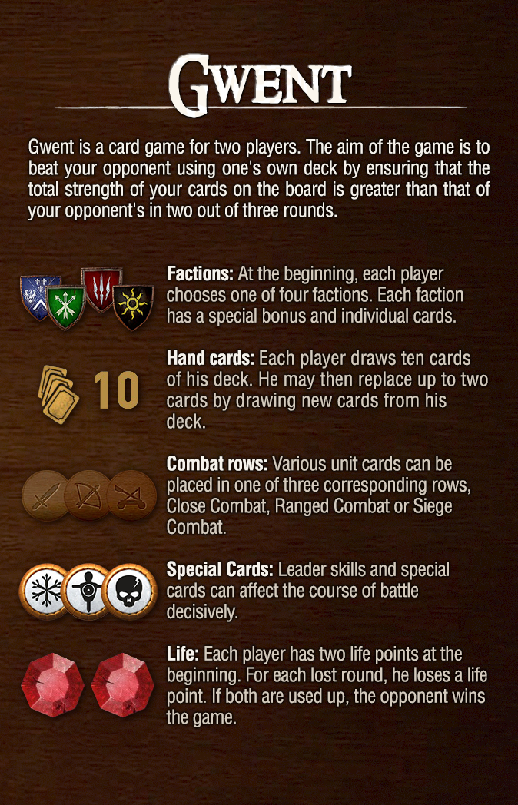
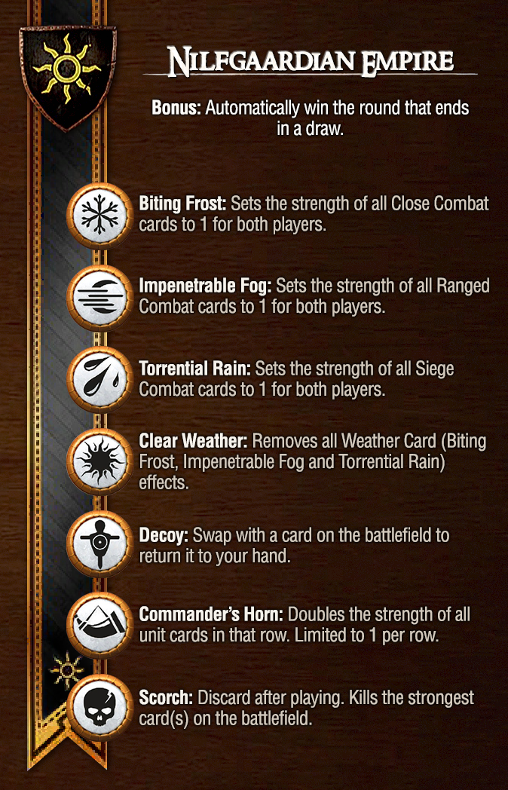
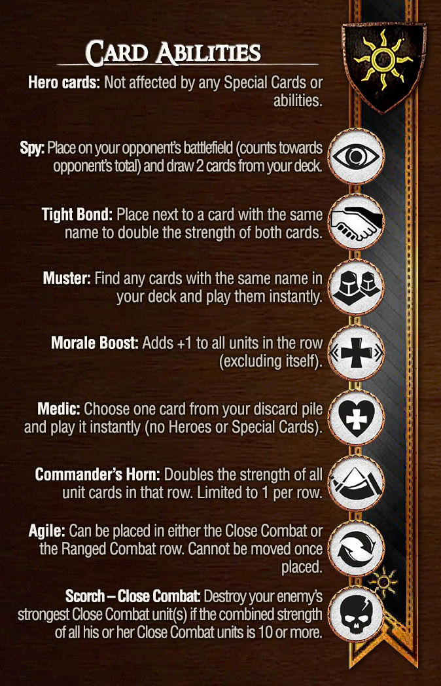

[](https://github.com/Elyan-Gruau/Gwen/actions/workflows/ci.yml)
# Gwen

A Gwent-like multiplayer card game.

## Table of contents

- [Project overview](#project-overview)
- [Monorepo structure](#monorepo-structure)
- [Implemented features](#implemented-features)
- [Run locally](#run-locally)
- [Build, lint, test](#build-lint-test)
- [Assets](#assets)
- [AI usage in the project](#ai-usage-in-the-project)
- [Work distribution](#work-distribution)

## Project overview

Gwen is a 1v1 card game inspired by Gwent.

Main gameplay rules:

- Two players compete over multiple rounds.
- Cards are placed on rows: `MELEE`, `RANGED`, `SIEGE`.
- `AGILE` cards can be placed on `MELEE` or `RANGED` rows.
- Players can play a card or pass.
- Gems system: each player starts with 2 gems and loses one on round loss (draw = both lose one).
- Match ends when a player reaches 0 gems.
- Ranked matchmaking with ELO and progressively expanding search range.

Gameplay video: https://www.youtube.com/watch?v=sphmZC2U06Y

<p align="center">



</p>

## Monorepo structure

This repository is a monorepo using npm workspaces.

- `gwen-client`: React + Vite frontend
- `gwen-server`: Node.js + Express + Socket.IO backend
- `gwen-common`: shared domain models/types/game logic
- `gwen-generated-api`: generated API client (OpenAPI)

## Implemented features

- Authentication (register/login, JWT)
- Profile page
- Deck builder (faction/leader selection, deck validation, favorite deck, row distribution)
- Game logic:
  - place card
  - pass turn
  - round resolution
  - end game
  - agile card placement (`MELEE` / `RANGED`)
  - timed turns
  - resign option
- ELO system:
  - ELO gain/loss based on opponent rating and result
  - persistence in database
- Matchmaking:
  - WebSockets events
  - ELO-aware pairing
  - expanding search range over time
  - queue/pool information in UI
- Theme support:
  - light/dark toggle
  - persisted in browser localStorage
  - first load defaults from `prefers-color-scheme`
- Sound effects:
  - card placement, pass turn, round win/loss, game win/loss, timer tick
- Rules page

### Constraints checklist

- Monorepo architecture: ✅
  - Equivalent to requested `api/client` split through `gwen-server` and `gwen-client`
- React frontend + Node.js backend: ✅
- Docker Compose for database: ✅ (`docker-compose.yml` with MongoDB)
- Responsive UI: ✅ (SCSS modules, responsive layouts/media queries)
- TypeScript: ✅ (full stack)
- Request handling (errors + loading states/spinners): ✅
- SPA + router: ✅ (`react-router-dom`)
- Client-side form validation: ✅ (Formik + Yup for auth forms)
- Linter: ✅ configured (ESLint setup is present in all packages)
- Real-time communication with WebSockets: ✅ matchmaking and gameplay realtime events

## Run locally

### Full Docker

```bash
./scripts/launch-project.sh
```

Then open:

- Frontend: `http://localhost:5173`
- Backend API: `http://localhost:3000`

### Local dev with workspaces

```bash
npm install
npm run dev
```

This starts client + server + common package watchers.

### Clean project artifacts

```bash
./scripts/clean-project.sh
```

This removes `dist`, `node_modules`, `tsconfig.tsbuildinfo` and stops docker compose resources.

## Build, lint, test

```bash
npm run build
npm run lint
npm run typecheck
npm run test
```

## Assets

- Icons from svgrepo
- Card visuals from https://github.com/matt77hias/Gwent

## AI usage in the project

Models used:

- GPT 5.2
- GPT 4.1
- Claude Haiku 4.5

AI was used for:

- ideation for factions/cards
- fixing targeted technical issues (TypeScript, SCSS, OpenAPI)
- implementing isolated features
- narration and Gwent inspired scss for Rules page

It was not used to define the full architecture of the project.

## Work distribution

### Adrien Passeron

- Profile page
- Game logic
- Home page
- Light/dark theme
- UI/UX improvements
- Win/lose page
- ELO calculation
- Metadata and final fixes

### Elyan Gruau

- Authentication
- Matchmaking
- Dockerization
- Login page
- Sign-up page
- Deck builder

### Delphine Pothin (from 15/04 to 17/04)

- Resign option 
- Timed turns
- Sound effects
- Row distribution in deck builder
- Match history on profile page
- Rules page

## Next updates

- Special card effects
- Leader abilities
- More decks stats in deck building
- Profile edit
- Card animation
- AI opponent
